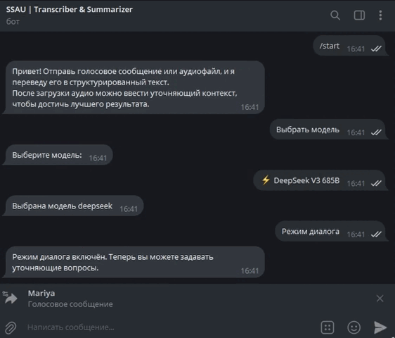

# 🤖 Transcriber & Summarizer Bot

Телеграм-бот, который преобразует голосовые сообщения и аудиофайлы в текст, а затем с помощью языковой модели структурирует и выделяет основную информацию.



## Особенности проекта

- 🎤 **Транскрипция аудио:**<br>Использование модели `Whisper` для преобразования голосовых сообщений и аудиофайлов в текст.
- 📑 **Структурирование информации:**<br>Применение API для анализа и выделения сути аудио с помощью языковых моделей.
- 💬 **Работа с контекстом:**<br>Поддержка уточняющих вопросов и дополнительного контекста для повышения точности результата.

## 📌 Как пользоваться

### Отправка аудио
Бот принимает голосовые сообщения (в том числе пересланные из другого диалога), а также аудиофайлы.<br>
Просто отправьте их в чат.

### Уточнение контекста
После получения аудио бот предложит добавить контекст.<br>
Это поможет языковой модели понять предметную область.<br>
- Нажимаем кнопку `Уточнить` и вводим контекст, например `Это требования заказчика к мобильному приложению о системе бронирования авиабилетов`.<br>
- Или `Не нужно`, если аудио не требует контекста для понимания.

### Смена модели
В боте доступны 4 языковые модели:
- `DeepSeek V3 685B` (Рекомендуем)
- `DeepSeek R1`
- `Gemini Pro 2.0`
- `Qwen: QwQ 32B`

Чтобы выбрать модель, нажмите соответствующую кнопку в главном меню.

### Режим диалога
Если вам требуется загрузить несколько аудио или вы хотите задать вопросы по распознанному тексту, нажмите кнопку `Режим диалога`.<br>
В этом режиме бот будет сохранять транскрипции и ваши вопросы, позволяя вести полноценный диалог с языковой моделью. 

## Используемые технологии

- **Язык программирования:** Python
- **Библиотеки и инструменты:**
  - [python-dotenv](https://github.com/theskumar/python-dotenv) – для работы с переменными окружения
  - [python-telegram-bot](https://github.com/python-telegram-bot/python-telegram-bot) – для создания Telegram-бота
  - [pydub](https://github.com/jiaaro/pydub) – для обработки аудиофайлов
  - [Whisper](https://github.com/openai/whisper) – для транскрипции аудио
  - [Torch](https://pytorch.org/) – для работы с моделями глубокого обучения
  - [requests](https://docs.python-requests.org/) – для отправки HTTP-запросов к API
  - [FFmpeg](https://ffmpeg.org/) – для конвертации аудио


## Установка и запуск

### 1. Склонируйте репозиторий

```bash
git clone https://github.com/algorithm-ssau/6302-TEAM-6.git
```

### 2. Настройте FFmpeg

- Скачайте и установите FFmpeg с [официального сайта](https://ffmpeg.org/).
- Если вы изменили стандартный путь для установки, измените его в коде:
```python
# Настройка ffmpeg
os.environ["PATH"] += os.pathsep + r"C:\ffmpeg\bin"
AudioSegment.converter = r"C:\ffmpeg\bin\ffmpeg.exe"
AudioSegment.ffprobe = r"C:\ffmpeg\bin\ffprobe.exe"
```

### 3. Установите библиотеки

Для запуска бота потребуется установить несколько библиотек.<br>
Для этого запустите команду в терминале:
```bash
pip install python-dotenv python-telegram-bot pydub torch requests git+https://github.com/openai/whisper.git
```

### 4. Получите токен бота

- Перейдите в [@BotFather](https://t.me/botfather) в Telegram
- Создайте нового бота: `/newbot` -> Введите `Публичное имя бота` -> Введите `Внутреннее имя бота` (будет использоваться в ссылке)
- Скопируйте токен:
```bash
Use this token to access the HTTP API:
123456789:abcdefghijk # здесь будет настоящий токен
Keep your token secure and store it safely, it can be used by anyone to control your bot.
```

### 5. Получите ключ OpenRouter
Для запросов к языковым моделям используется API OpenRouter.
- Перейдите на сайт [openrouter.ai](https://openrouter.ai/) и зарегистрируйтесь.
- В меню профиля выберите `Keys` -> `Create Key` -> Введите `Имя для ключа`, поле `Credit limit` оставьте пустым.
- Скопируйте ключ.

### 5. Настройте окружение
Создайте в корне проекта файл `.env` и заполните его:
```python
TELEGRAM_TOKEN=[токен, полученный на шаге №4]
OPENROUTER_API_KEY=[ключ, полученный на шаге №5]
```

### 6. Завершение
- Запустите бота, дождитесь скачивания и установки Whisper.

**Внимание!** В проекте используется `medium`-версия модели.<br>
Если у вас `~10Гб` видеопамяти, рекомендуется использовать `large`-версию:
```python
# Заменить "medium" на "large":
model = whisper.load_model("medium", device=device)
```
Если у вас менее `5Гб` видеопамяти, выберите подходящую модель из таблицы.<br>
Но помните - чем <ins>меньше параметров</ins>, тем <ins>ниже качество</ins> распознавания текста.
| Модель | Кол-во параметров | Кол-во видеопамяти | Относительная скорость |
|--------|-------------------|--------------------|------------------------|
| tiny   | 39 M              | ~1 Гб.             | ~10x                   |
| base   | 74 M              | ~1 Гб.             | ~7x                    |
| small  | 244 M             | ~2 Гб.             | ~4x                    |
| medium | 769 M             | ~5 Гб.             | ~2x                    |
| large  | 1550 M            | ~10 Гб.            | 1x                     |
| turbo  | 809 M             | ~6 Гб.             | ~8x                    |

## Разработчики
**Team 6 – 6302 – 2025** | Студенты группы 6302-020302D
- Я.В. Аграномов  / [Nu11Object](https://github.com/Nu11Object)
- Б.Г. Григорьева / [C1eem](https://github.com/C1eem)
- М.О. Долгова    / [MariaD04](https://github.com/MariaD04)
- Е.В. Мамонтов   / [JijaEdem666](https://github.com/JijaEdem666)
- Н.В. Пишков     / [LastHope777](https://github.com/LastHope777)
